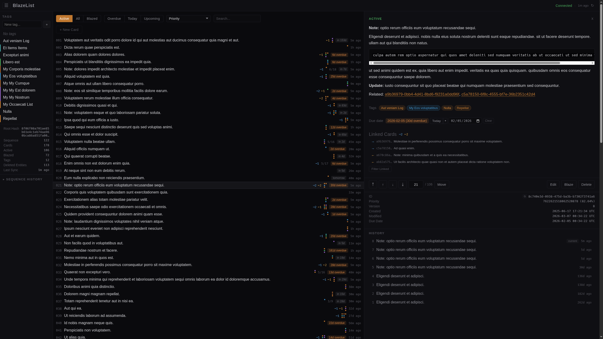
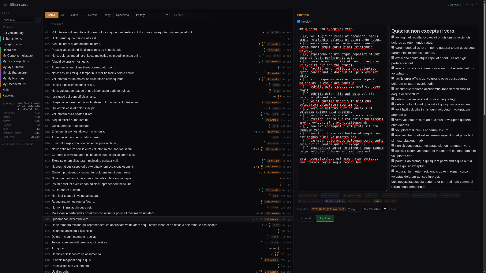

<div align="center">

# BlazeList
**Blazingly fast sorted list of Markdown cards. 🔥**

A TODO list of sorts—one list to rule them all: centered around a mono-list called the Blaze List.

Designed to scale to thousands of cards without introducing noticeable latency or lag, with local caching and non-destructive sync.

</div>

<p align="center">
  &nbsp;&nbsp;&nbsp;&nbsp;
</p>

---

> [!WARNING]
> **This project is in active development.**
>
> ⚠️ **It is not recommended to run this in production with data you care about unless you are fully aware of the risks and take the necessary precautions.**
>
> 🔓️ **No network security or credential management is implemented — you're therefore responsible for securing your deployment.**
>
> - Breaking changes are expected
> - Initial iterations rely heavily on large quantities of vibe-coded code with very little review or attention given so far
> - This is intentional during the prototyping phase to enable fast iteration and experimentation
> - Code quality standards will be raised as the architecture stabilizes

## Quick Start (Docker)

```bash
docker compose up
# Web UI at https://localhost:47800
```

The container can run as any UID/GID — see `docker-compose.yml` for details.

## Documentation

| Document | Description |
|---|---|
| **[SPEC.md](SPEC.md)** | Technical specification — architecture, data model, integrity, sync protocol, and design rationale |
| **[DOCS.md](DOCS.md)** | User guide — deployment, configuration, environment variables |
| **[DEV.md](DEV.md)** | Developer guide — local development workflow, building, testing |

## Licensing

Licensed under either of

- [Apache License, Version 2.0](LICENSE-APACHE)
- [MIT License](LICENSE-MIT)

at your option.
