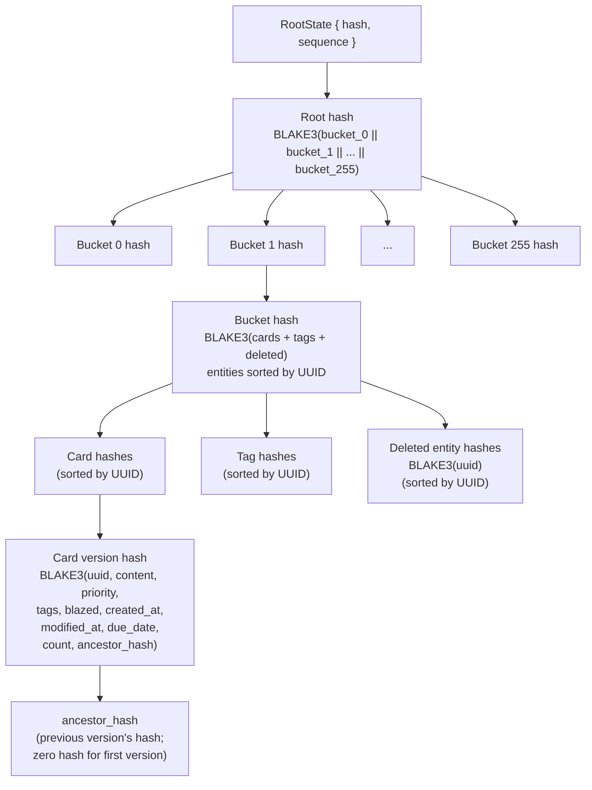
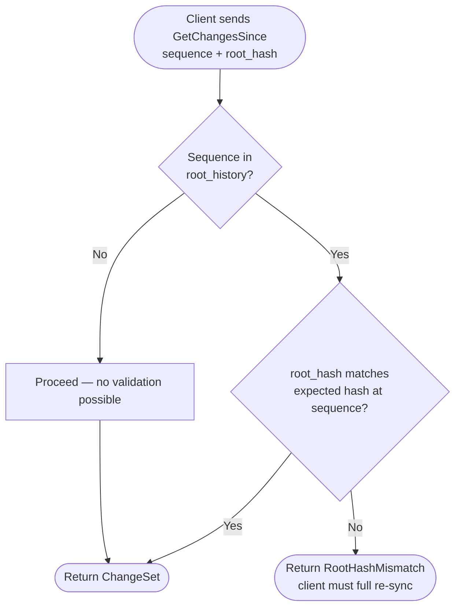
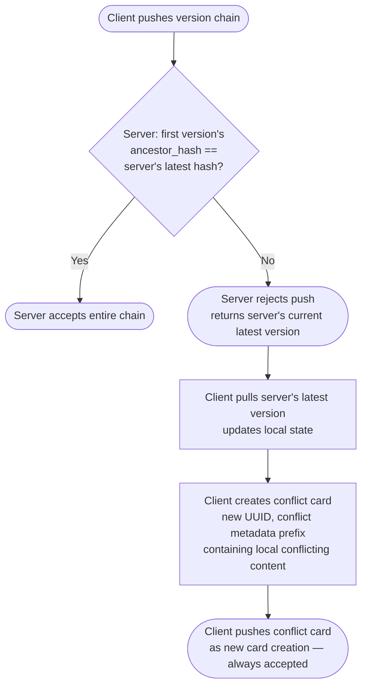
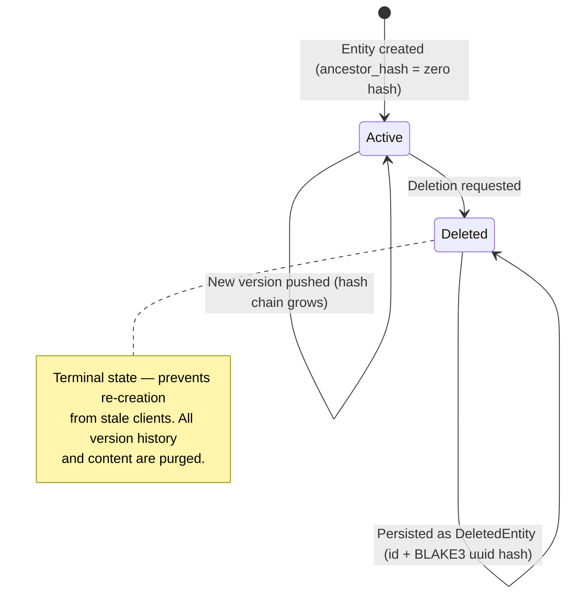
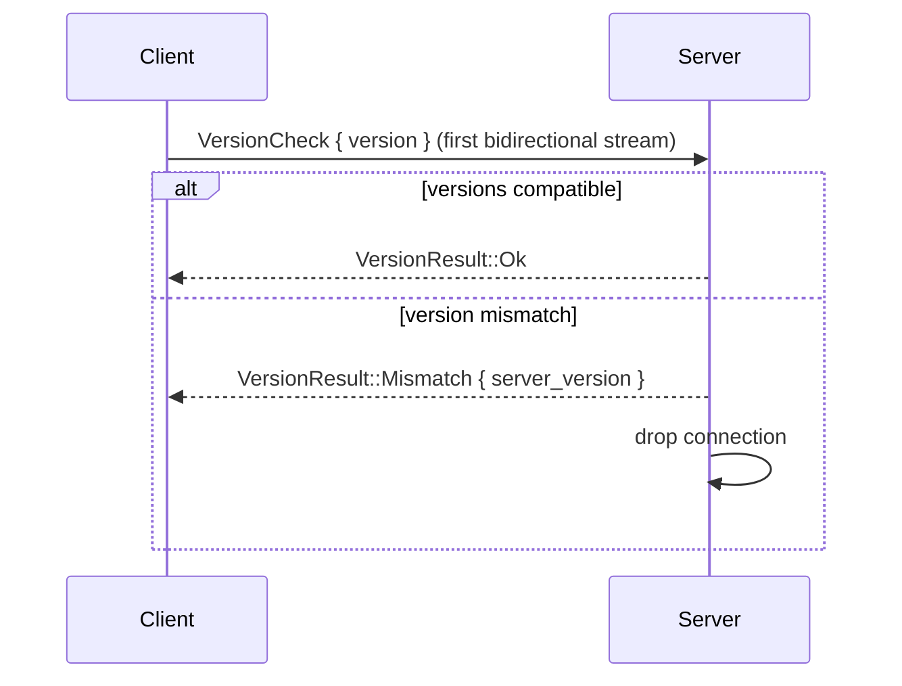
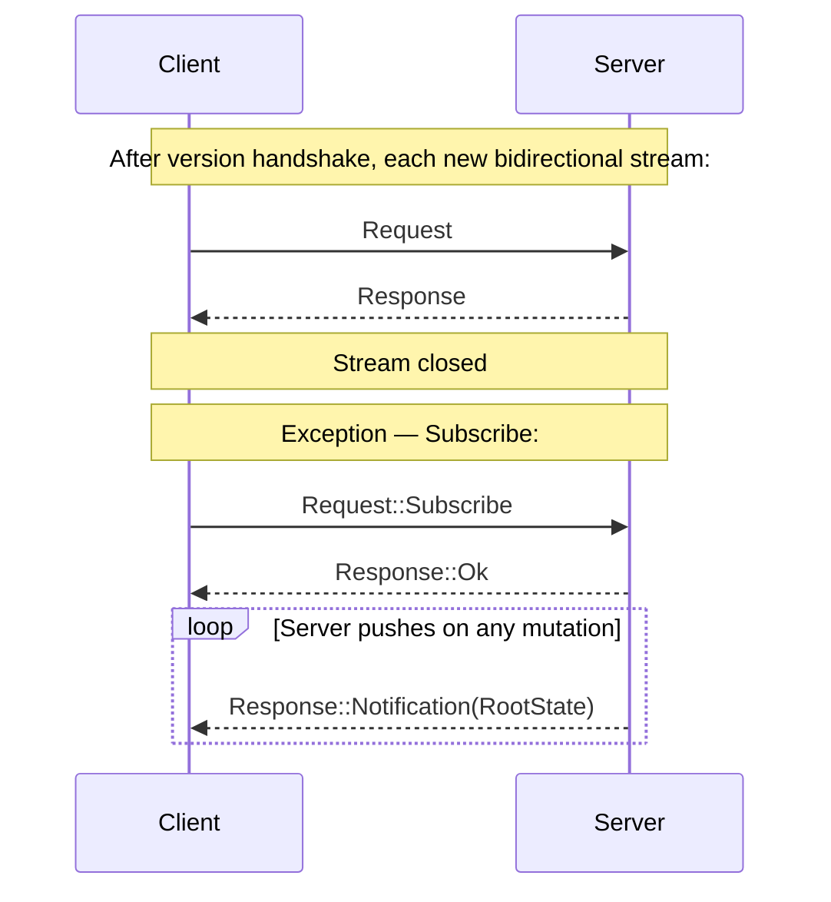

# BlazeList — Technical Specification

This document describes the architecture, data model, integrity system, sync protocol, and design rationale for BlazeList.

## Architecture Overview

BlazeList is a mono-repo Rust project with the following crates:

| Crate | Location | Description |
|---|---|---|
| `blazelist-protocol` | `protocol/` | Shared types and communication protocol definitions. Its version governs client↔server compatibility. |
| `blazelist-server` | `server/` | Self-hostable server with QUIC + WebTransport transports. Uses SQLite storage. |
| `blazelist-wasm` | `clients/wasm/` | WebAssembly front-end client (Leptos PWA), communicates over WebTransport. |
| `blazelist-client-lib` | `clients/lib/` | Platform-agnostic shared library — display utilities, filtering, sync helpers. |
| `blazelist-dev-seeder` | `clients/dev-seeder/` | Deterministic test data generator. Connects over QUIC. |

### Server

Self-hostable Blaze server. Supports two transports simultaneously: [QUIC](https://en.wikipedia.org/wiki/QUIC) (UDP, port 47200) for native clients and [WebTransport](https://developer.mozilla.org/en-US/docs/Web/API/WebTransport_API) (port 47400) for browser-based clients. Both transports share a single self-signed TLS certificate. An HTTP endpoint (port 47600) serves the certificate's SHA-256 hash so WASM clients can auto-fetch it for `serverCertificateHashes`.

Uses SQLite storage.

### WebAssembly Client (PWA)

Front-end client built entirely in Rust, compiled to WebAssembly, and deployed as a Progressive Web App. Uses [Leptos](https://github.com/leptos-rs/leptos) for client-side rendering and communicates with the server over [WebTransport](https://developer.mozilla.org/en-US/docs/Web/API/WebTransport_API). All logic — including priority arithmetic, hashing, and serialization — runs natively in WASM, with no JavaScript runtime dependency.

### Client Library

Platform-agnostic shared library (`blazelist-client-lib`). Provides:

- **Display utilities** — Markdown-to-plain-text rendering and card preview generation using [comrak](https://github.com/kivikakk/comrak).
- **Filtering** — Card filtering pipeline: blaze status → search query → tag selection (AND/OR mode).
- **Sync helpers** — Incremental changeset application for keeping local state in sync with the server.

Feature flags:
- `native` — For native builds. Uses a local SQLite database as a cache for offline-first operation.
- `wasm` — For WebAssembly builds. No local cache — the WASM PWA requires a server connection and is not functional offline.

### Protocol

The protocol crate (`blazelist-protocol`) contains all shared types (Card, Tag, RootState, DeletedEntity, NonNegativeI64, Version, etc.) and the communication protocol definitions (request/response enums, wire framing, version handshake logic, hash utilities). Its version governs client↔server compatibility and is used in the version handshake.

### Dev Seeder

A tool for generating deterministic test data. Uses a seeded ChaCha8Rng for reproducible output so the same seed always produces the same cards and tags. Connects to the server over QUIC and pushes generated entities using the standard protocol.

Options: `--server <ADDR>` (default `127.0.0.1:47200`), `--seed <NUM>` (default `42`), `--cards <NUM>` (default `1000`), `--tags <NUM>` (default `15`).

---

## Data Model

### Cards

Cards are the fundamental unit of the Blaze List. Each card is a [GitHub Flavored Markdown (GFM)](https://github.github.com/gfm/) document — there is no separate title field, everything is markdown content.

Every card is identified by a unique UUIDv4. UUIDv7 (time-based) was considered but rejected: it bakes a millisecond timestamp into every card's identity, which contradicts the design philosophy that timestamps are just metadata and hash chains + counts are the authority on state. UUIDv4 is also simpler and faster — just 128 random bits, no clock read, no monotonicity tracking, no clock-skew edge cases between clients.

```rust
pub struct Card {
    id: Uuid,
    content: String,
    priority: NonNegativeI64,
    tags: Vec<Uuid>,
    blazed: bool,
    created_at: DateTime<Utc>,       // serialized as milliseconds
    modified_at: DateTime<Utc>,      // serialized as milliseconds
    due_date: Option<DateTime<Utc>>, // optional due date, serialized as optional milliseconds
    count: NonNegativeI64,
    ancestor_hash: blake3::Hash,     // zero hash (32 zero bytes) for the first version
    hash: blake3::Hash,
}
```

Each version stored on the server is the same `Card` struct — a snapshot of the card at that count. The server stores every version in a `card_versions` table keyed by `(card_id, count)`.

### Tags

Tags are identified by a UUID and have a title and an optional color (`RGB8` from the `rgb` crate). In the future, icons (both custom and Unicode emojis) and a description could be supported.

```rust
pub struct Tag {
    id: Uuid,
    title: String,
    color: Option<RGB8>,             // optional RGB color, e.g. RGB8::new(0xc0, 0x78, 0x30)
    created_at: DateTime<Utc>,       // serialized as milliseconds
    modified_at: DateTime<Utc>,      // serialized as milliseconds
    count: NonNegativeI64,
    ancestor_hash: blake3::Hash,     // zero hash (32 zero bytes) for the first version
    hash: blake3::Hash,
}
```

#### Tag Filtering

Cards can be filtered by tags using **AND** or **OR** logic:

- **OR:** Show cards that have *any* of the selected tags. For example, selecting `Shopping` OR `Groceries` returns cards tagged with either (or both).
- **AND:** Show cards that have *all* of the selected tags. For example, selecting `Technology` AND `Research` returns only cards tagged with both.

### DeletedEntity

When a card, tag, or any UUID-identified entity is deleted, it becomes a `DeletedEntity`. This is a distinct type that only contains the UUID and the hash of the entity. Using a separate type (rather than making fields on `Card` or `Tag` optional) is more strict and less error-prone. Since UUIDs are already unique across all tables (cards, tags, etc.), a single `DeletedEntity` type can represent any deleted entity by UUID, which is more flexible and consistent.

```rust
pub struct DeletedEntity {
    id: Uuid,
    hash: blake3::Hash,              // BLAKE3(uuid bytes)
}
```

### Blaze List (Root State)

The root represents the overall state of the list:

```rust
pub struct RootState {
    pub hash: blake3::Hash,
    pub sequence: NonNegativeI64,
}
```

The root hash is computed from 256 cached bucket hashes: `BLAKE3(bucket_0 || bucket_1 || ... || bucket_255)`. Each bucket corresponds to the first byte of the entity UUID, and its hash is `BLAKE3(cards + tags + deleted)` with entities sorted by UUID within each category. If all buckets are empty, the root hash is the zero hash (32 zero bytes). On mutation, only the affected bucket(s) are recomputed, then the root is derived from the 256 cached bucket hashes — cost per mutation is O(N/256 + 256) instead of O(N). The root sequence is server-assigned and increments on any mutation to any entity. Used for quick sync checks — if a client's root hash + sequence matches the server's, no per-card comparison is needed.

### Blazing and Extinguishing

Blazing is the archive/done feature — the core action that gives BlazeList its name. **Blaze** (🔥) marks a card as archived/done. **Extinguish** (🚀) restores a card to active status.

---

## NonNegativeI64 — Why `i64`?

Priority, count, and sequence values are represented by `NonNegativeI64` — a wrapper around `i64` that guarantees the value is always ≥ 0.

**Why not `u64`?** SQLite's `INTEGER` type and PostgreSQL's `BIGINT` are both signed 64-bit. Using `i64` ensures direct storage compatibility without conversion — no casting, no edge-case bugs at the boundary. The usable range (0 to `i64::MAX` = 9,223,372,036,854,775,807) is half of `u64`, but still far beyond any realistic usage.

**Why not `u128` or larger?** There is no practical benefit. `i64::MAX` provides over 9.2 quintillion distinct priority values. Even with aggressive midpoint splitting, exhaustion is not a realistic concern. Larger types would add serialization overhead, break database compatibility, and complicate arithmetic — all for no practical gain.

```rust
pub struct NonNegativeI64(i64);

impl NonNegativeI64 {
    pub const MAX: Self = Self(i64::MAX);   // 9,223,372,036,854,775,807
    pub const MIN: Self = Self(0);
}
```

---

## Prioritization

Every card in the Blaze List has a priority represented by `NonNegativeI64`.

A placed card takes the midpoint (floored) between the card above it and the card below it. If there is no card above, `NonNegativeI64::MAX` (`i64::MAX`) is used in its place; if there is no card below, `NonNegativeI64::MIN` (`0`) is used. The midpoint is then calculated between the existing neighbor and the substituted boundary value.

After computing the midpoint, a small random jitter is added. This prevents collisions when two clients independently place or move cards into the same gap — without jitter, they would compute the exact same midpoint, resulting in a priority tie. The jitter is a random offset within a small range relative to the gap size (gap/16), ensuring uniqueness while keeping the card visually in the correct position.

The server enforces priority uniqueness via a unique index. If a pushed card has a priority that collides with an existing card, the server rejects the push with `DuplicatePriority { conflicting_id, priority }`. The client should recompute the priority with fresh jitter and retry.

The moved card is the only one updated.

---

## Integrity and Hashing

Every transaction is logged; everything is snapshotted with BLAKE3 sums.

The structure is essentially a Merkle tree:

- **Card level:** Each card has a hash chain — every version's hash is `BLAKE3(uuid, content, priority, tags, blazed, created_at, modified_at, due_date, count, ancestor_hash)`. All fields including the count and ancestor hash are hashed together, forming a verifiable linear history. The count is incremented on every edit.
- **Bucket level:** Entities are partitioned into 256 buckets by the first byte of their UUID (uniform distribution for UUIDv4). Each bucket hash is `BLAKE3(cards_in_bucket + tags_in_bucket + deleted_in_bucket)`, with entities sorted by UUID within each category. On mutation, only the affected bucket is recomputed — cost per mutation is O(N/256 + 256) instead of O(N).
- **Root level:** The Blaze List itself has a root hash — `BLAKE3(bucket_0 || bucket_1 || ... || bucket_255)`, derived from the 256 cached bucket hashes. The root also has its own sequence number, incremented on any change to any card or tag (creation, edit, or deletion).

This gives three levels of integrity checking: the root hash + sequence for quick "am I in sync?" checks, per-bucket hashes for efficient incremental recomputation, and per-card hash chains for verifying individual card history.



### Canonical Hash Format

Card hashes use a fixed canonical byte layout:

```
[16B UUID][8B content_len][N UTF-8 content][8B i64 priority][8B tag_count]
[16B*M sorted tag UUIDs][1B blazed u8][8B created_at_ms][8B modified_at_ms]
[1B has_due_date][8B due_date_ms (if present)][8B count][32B ancestor_hash]
```

All multi-byte integers are big-endian. Tag UUIDs are **sorted** before hashing to ensure deterministic results regardless of the order in which tags were assigned on the client. The version hash is always a single BLAKE3 over all fields — no per-field hashing. This mirrors git, which hashes the entire commit object at once.

### Root History

The server maintains a history of all root states in a `root_history` table. Every time the root state changes (on any mutation), the new sequence number and root hash are recorded. This enables corruption detection during incremental sync: when a client claims to be at sequence N with hash H, the server can verify that H matches the expected hash at sequence N. If the hashes don't match, the client's state is corrupted and needs a full re-sync rather than applying a delta on top of corrupted state.

---

## State and Conflict Resolution

State is tracked at two levels, both using a BLAKE3 hash and a sequence number (similar to ZFS transaction groups):

- **Root (Blaze List):** A single hash (composed from all card, tag, and deleted entity hashes) and a root sequence. The root sequence is server-assigned and incremented on every mutation. If a client's root hash + sequence matches the server's, the client is fully in sync — no need to check individual cards.
- **Card:** Each card has its own hash chain and count. The per-card count is client-assigned (set when creating a version) and is part of the hashed content. The hash chain (each version's hash includes its direct ancestor hash) is the true source of lineage — the count is a convenience for quick ordering and staleness checks, not the authority on history.

This makes timestamps irrelevant for state — they are just metadata.

### Version History

Every change to a card produces a new version. Each version contains:

- The card data (content, priority, tags, blazed status, etc.)
- The **direct ancestor hash** — the BLAKE3 hash of the direct ancestor version
- The **version hash** — BLAKE3(card data fields + direct ancestor hash)
- The **count** (set by the client when creating versions locally; the count is part of the hashed content, so the server accepts it as-is if the hash chain is valid)

The hash chain is the source of truth for lineage. The count is a convenience for ordering and quick staleness checks. The first version of a card has a direct ancestor hash of zero (32 zero bytes). The version hash is always a single BLAKE3 over all fields — no per-field hashing.

The server **stores every version**, not just the latest. This provides a complete audit trail — every change is logged, every past state is retrievable, and in the future, any version can be restored.

### Incremental Sync

When root hashes don't match, the client uses `GetChangesSince { sequence, root_hash }` to sync incrementally:

1. The client sends its last known root sequence and its root hash at that sequence.
2. The server validates the hash against the root history. If the hash doesn't match the expected hash at that sequence, the server responds with `RootHashMismatch` — indicating that the client's state is corrupted and needs a full re-sync rather than applying a delta.
3. If the hash matches, the server returns a `ChangeSet` containing all cards, tags, and deletions that occurred after that root sequence, plus the current `RootState`.
4. The client applies the changes locally and updates its root sequence.

This works because the server stamps every mutation with the current root sequence (`root_sequence_at` in storage). Only entities modified after the client's last known sequence are returned, avoiding a full list transfer.

A client can combine this with `Subscribe` for real-time sync: receive a `Notification(RootState)`, compare the root hash + sequence, and call `GetChangesSince` if they differ.

#### Corruption Detection

The server maintains a complete history of root states in the `root_history` table. Every mutation records the new sequence number and root hash. When a client calls `GetChangesSince`, the server looks up the expected hash at that sequence and compares:

- **Hash matches:** The client's state is valid. Proceed with incremental sync.
- **Hash mismatch:** The client's state is corrupted (e.g., due to a bug, disk corruption, or partial sync failure). The server responds with `RootHashMismatch { sequence, expected_hash }` so the client knows to discard its local state and perform a full re-sync.
- **Sequence not in history:** The sequence predates the history table or is the initial state. The server proceeds anyway (no validation possible).

This prevents clients from applying deltas on top of corrupted state, which would lead to divergent and incorrect data.



### Server: Enforce Linear History

The server enforces linear history per card. A push sends a chain of one or more new versions. The server checks that the **first version's direct ancestor hash matches the server's current latest hash** for that card:

- direct ancestor hash matches → accept the entire chain (counts are client-provided and part of the hash), store every version
- direct ancestor hash does not match → **reject** the push, respond with the server's current latest version (hash + count)

The hash is the real check. Two clients can independently produce versions with the same count (both editing offline from the same base), but the direct ancestor hash will differ because their chains diverged. The direct ancestor hash proves the client's history descends from the server's history — not just that the client thinks it's at the same count.

The server does no merging. It is a strict gatekeeper: if the client's chain does not extend the server's chain, the push is rejected. This is analogous to `git push` rejecting a non-fast-forward push: the client must pull, resolve locally, then retry.

**Example — client is ahead by multiple versions:**

```
Server has:  v1(hash=A) → v2(hash=B)
Client has:  v1(hash=A) → v2(hash=B) → v3(hash=C) → v4(hash=D)

Client pushes [v3, v4]. Server checks v3's direct ancestor hash == B (its current latest). Match → accept both.
Server now has: v1(A) → v2(B) → v3(C) → v4(D), counts assigned 1-4.
```

**Example — conflict (diverged chains):**

```
Server has:  v1(A) → v2(B) → v3(X)       [client A pushed v3]
Client B:   v1(A) → v2(B) → v3(Y)        [different v3, direct ancestor hash B]

Client B pushes [v3(Y)]. Server checks v3(Y)'s direct ancestor hash == B, but server's latest is X (count 3).
direct ancestor hash B ≠ latest hash X → reject.
```

### Client: Conflict Resolution

Resolution is entirely the client's responsibility. When a push is rejected, the client receives the server's current latest version and must reconcile before retrying.



The client creates a **new card** (with a new UUID) containing the conflicting local version, prefixed with conflict metadata. The original card on the server is left untouched. No data is lost: the server version stays in place, and the conflicting local version lives in its own card.

This keeps the server simple and stateless with respect to conflicts. No `Conflicted` card state, no conflict fork tables — just the linear history invariant.

### Deletion

While the system is designed to never lose data during normal operation, a card (or tag, or any UUID-identified entity) can be explicitly **deleted**. Deletion is the one exception to "keep everything."



When an entity is deleted:

1. **The entity is replaced by a `DeletedEntity`** containing only the UUID and its hash.
2. **Everything else is purged**: content, priority, tags, blazed status, all version history, the count — all gone.
3. **The `DeletedEntity` hash is simply `BLAKE3(uuid)`** — since there is nothing else left to hash.

Deletion is **infectious**. When a deletion propagates (client to server, or server to client), it purges everything associated with that UUID on the receiving side. The `DeletedEntity` must be persisted indefinitely to prevent a deleted entity from being accidentally re-created or re-synced from a stale client.

---

## Communication Protocol

### Wire Format

Every message is length-prefixed postcard binary. Max message size: 16 MiB.

```
[4-byte big-endian u32 length][postcard payload]
```

### Version Handshake

The first bidirectional stream on each connection is a version handshake. The client sends a `VersionCheck`, the server replies with a `VersionResult`. On mismatch the connection is dropped.

```rust
struct VersionCheck {
    version: Version,
}

enum VersionResult {
    Ok,
    Mismatch { server_version: Version },
}
```

Compatibility check: versions are compatible if they share the same major version (standard [Semantic Versioning](https://semver.org/) rules).



### Request / Response

After the version handshake, each subsequent bidirectional stream carries a single request/response pair: the client sends a `Request`, the server replies with a `Response`, and the stream is closed. The exception is `Subscribe`, which keeps the stream open (see below).



```rust
// Wire stability: postcard encodes variants by position.
// Do NOT reorder or insert before existing variants — append only.
enum Request {
    // Cards
    PushCardVersions(Vec<Card>),        // → Response::Root
    GetCard { id: Uuid },               // → Response::Card
    GetCardHistory { id: Uuid, limit: Option<u32> }, // → Response::CardHistory
    ListCards { filter: CardFilter, limit: Option<u32> }, // → Response::Cards
    DeleteCard { id: Uuid },            // → Response::Deleted

    // Tags
    PushTagVersions(Vec<Tag>),          // → Response::Root
    GetTag { id: Uuid },                // → Response::Tag
    ListTags,                           // → Response::Tags
    DeleteTag { id: Uuid },             // → Response::Deleted

    // Root state
    GetRoot,                            // → Response::Root

    // Incremental sync
    GetChangesSince { sequence: NonNegativeI64, root_hash: blake3::Hash }, // → Response::Changes

    // Batch operations
    PushBatch(Vec<PushItem>),           // → Response::Root

    // Real-time notifications (streaming — keeps the stream open)
    Subscribe,                          // → Response::Ok, then Response::Notification(RootState)…

    // Tag history (appended after Subscribe for wire stability)
    GetTagHistory { id: Uuid, limit: Option<u32> }, // → Response::TagHistory

    // Audit log
    GetSequenceHistory { after_sequence: Option<NonNegativeI64>, limit: Option<u32> }, // → Response::SequenceHistory
}

enum Response {
    Ok,
    Card(Card),
    Cards(Vec<Card>),
    Tag(Tag),
    Tags(Vec<Tag>),
    Root(RootState),
    Deleted(DeletedEntity),
    Changes(ChangeSet),
    Notification(RootState),
    Error(ProtocolError),
    CardHistory(Vec<Card>),
    TagHistory(Vec<Tag>),
    SequenceHistory(Vec<SequenceHistoryEntry>),
}

enum ProtocolError {
    NotFound,
    AlreadyDeleted,
    PushFailed(PushError),
    BatchFailed { index: u32, error: BatchItemError },
    RootHashMismatch { sequence: NonNegativeI64, expected_hash: blake3::Hash },
    UnsupportedRequest,
    Internal,
}

enum PushError {
    CardAncestorMismatch(Box<Card>),
    TagAncestorMismatch(Box<Tag>),
    AlreadyDeleted,
    HashVerificationFailed,
    EmptyChain,
    DuplicatePriority { conflicting_id: Uuid, priority: NonNegativeI64 },
}

enum CardFilter {
    All,
    Blazed,
    Extinguished,
}

enum PushItem {
    Cards(Vec<Card>),
    Tags(Vec<Tag>),
    DeleteCard { id: Uuid },
    DeleteTag { id: Uuid },
}

struct ChangeSet {
    cards: Vec<Card>,
    tags: Vec<Tag>,
    deleted: Vec<DeletedEntity>,
    root: RootState,
}

struct SequenceHistoryEntry {
    sequence: NonNegativeI64,
    hash: blake3::Hash,
    operations: Vec<SequenceOperation>,
    created_at: DateTime<Utc>,            // serialized as milliseconds
}

struct SequenceOperation {
    entity_id: Uuid,
    kind: SequenceOperationKind,
}

enum SequenceOperationKind {
    CardCreated,
    CardUpdated,
    TagCreated,
    TagUpdated,
    EntityDeleted,
}
```

### Batch Push

`PushBatch(Vec<PushItem>)` pushes multiple items (card version chains, tag version chains, deletions) in a single atomic transaction. If any item fails, the entire batch is rolled back. The server responds with `Root(RootState)` on success (containing the new root state after the batch) or `Error(ProtocolError::BatchFailed { index, error })` on failure, where `error` is a typed `BatchItemError` carrying the full error payload. All mutation requests (`PushCardVersions`, `PushTagVersions`, `PushBatch`) return `Response::Root` so the client can update its local root state without an extra round-trip.

### Subscribe (Real-time Notifications)

`Request::Subscribe` keeps the bidirectional stream open for push notifications. The server responds with `Response::Ok`, then sends `Response::Notification(RootState)` whenever any mutation occurs. The client can use a notification as a trigger to call `GetChangesSince` for incremental sync. This works across both QUIC and WebTransport.

---

## API Breakage and Semantic Versioning

Each crate in the workspace has its own independent version. All crates follow [Semantic Versioning](https://semver.org/). The **protocol crate version** (`blazelist-protocol`) is the one that governs client↔server compatibility and is used in the version handshake.

The version handshake enforces compatibility: versions are compatible if they share the same major version.

**Client and server crates** have their own versions, following standard semver independently. When the protocol crate makes a breaking change, downstream crates will need corresponding releases.

### Server Schema Version Check

The server stores the protocol version in its SQLite database when the database is first created. On every subsequent startup the server compares the stored version against the current binary's protocol version:

| Stored vs current | Behaviour |
|---|---|
| Same major version | Server starts normally; stored version is updated to current. |
| Different major version | Server **refuses to start** with an error explaining the mismatch. |

To allow a future automatic migration across breaking major versions, set the environment variable:

```bash
BLAZELIST_ALLOW_IRREVERSIBLE_AUTOMATIC_UPGRADE_MIGRATION=true
```

> [!CAUTION]
> Automatic migration is **not yet implemented**. Enabling the flag today will cause the server to exit with a "not yet implemented" error. The variable exists so the upgrade path is explicit and opt-in once migration logic is added.

---

## Future Ideas

### Non-API Breaking

- **Version History UI** — Allow clients to browse the full version history of a card.
- **Restore from History** — Restore a card to any previous version by creating a new version in the hash chain that reverts to old content (like `git revert`).
- **Card Markdown TODOs** — List and count TODOs for cards, e.g., display "4/5" if four of five TODO items are completed.
- **Card Due Times / Time Tagging** — Due dates, reminders, and time-based tagging.
- **Tag Rules** — Apply rules based on tags (e.g., `Groceries` always at bottom, `Practical Stuff` always at top).
- **Card Linking** — Link cards by UUID to create a linked structure.
- **AI Features** — Auto-tagging and other features (with privacy considerations for external models).
- **Predefined Filters** — Save filter configurations as named presets.
- **Automatic Field-Level Merging** — Three-way merges before falling back to conflict cards.
- **Inline Diff View** — Side-by-side diff UI for manual conflict resolution.
- **History Compaction** — Compact old versions to cold storage while keeping hash chain metadata.

### API Breaking

- **Card Attachments** — Attach arbitrary binaries to cards, deduplicated using BLAKE3 sums. **Deprioritized** — this feature has been purposefully deprioritized and won't be added in the immediate future. In the meantime, a practical workaround is to host an easily accessible file server on the same trusted network as BlazeList (since BlazeList has no users or security model, the network must already be trusted). Markdown image syntax (``) can embed images directly in cards, and regular markdown links (`[filename](url)`) can point to downloadable files.
- **Client-side PGP Encryption** — End-to-end encryption where the server never has access to plaintext card data.
